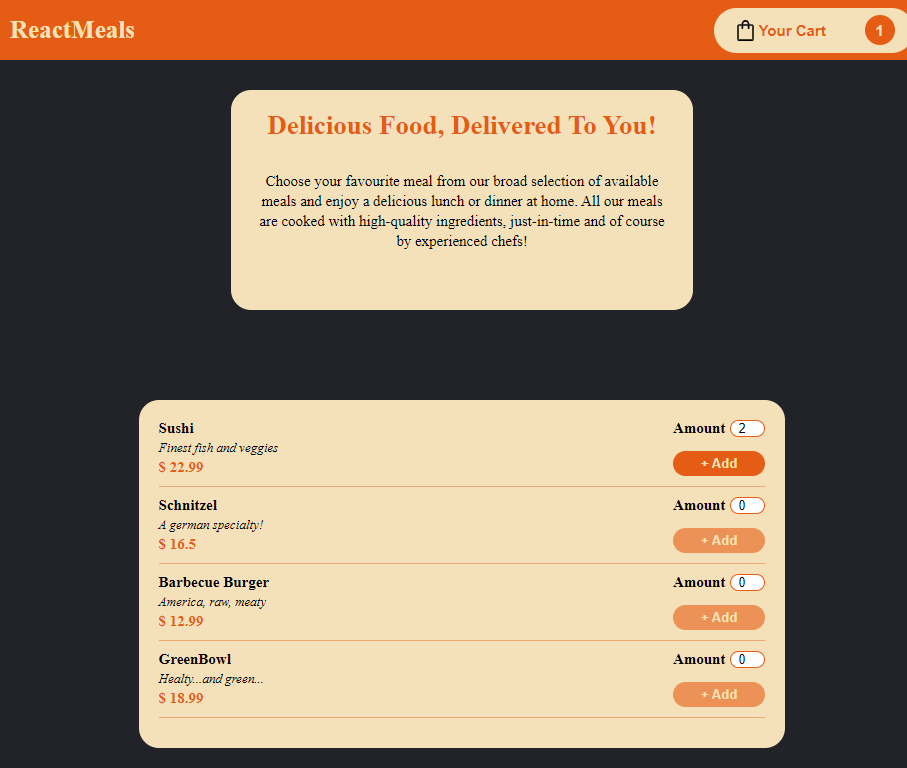
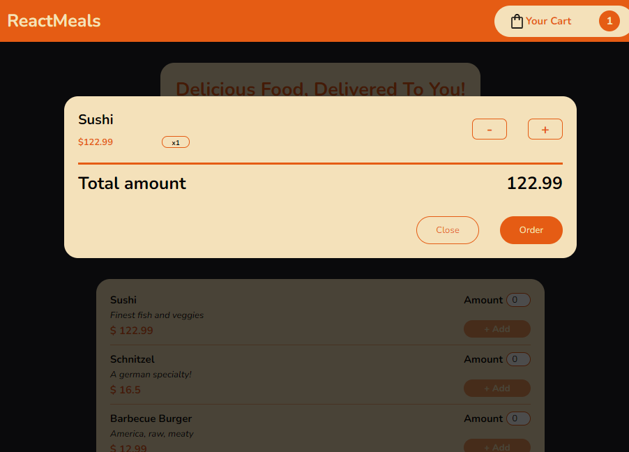
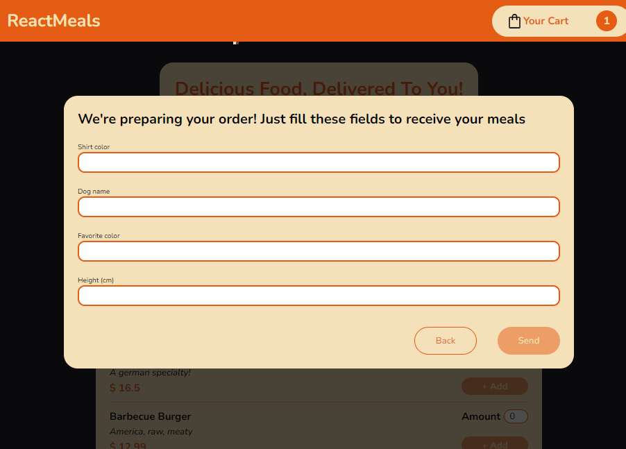

# ReactMeals - Simple "order food" Static Web App

## Table of contents

- [Overview](#overview)
  - [Screenshot](#screenshot)
  - [Links](#links)
- [My process](#my-process)
  - [Built with](#built-with)
- [Author](#author)

## Overview

Simple static Web App that mocks "order food" logics. Made with React and Framer Motion for the animations. React was used in order to get more practice with it (I'm a React beginner).

User form is made by nonsense fields; I did it on purpose because I don't want to store any kind of personal/sensitive data (this is just for practicing use, so I didn't want to get troubles with GDPR or privacy stuff :D)

### Screenshot

### Links

- Live Site URL: https://react-meals-phi.vercel.app/

## My process

### Built with

- React (JS Library)
- Framer motion (animation library)
- CSS custom properties
- Flexbox

## Author

- LinkedIn - Giovanni Ruberto - https://www.linkedin.com/in/giovanni-ruberto-179919107/
